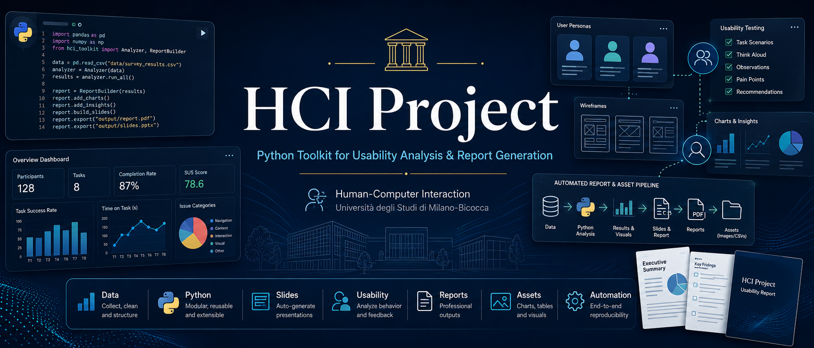

<p align="center">
  
</p>

# HCI Project Toolchain

## What This Repository Is

This repository is a reusable HCI project toolchain. It started from course-provided teaching material and was extended into a more complete workflow for heuristic evaluation, user testing, UEQ/NPS questionnaires, charts, tables, validation logs, and PowerPoint/PDF report generation.

The current project data compares Deliveroo and Glovo, but the structure is meant to be adapted by future students to other pairs of systems.

## What It Generates

- cleaned CSVs and validation reports;
- heuristic evaluation tables, charts, severity summaries and recommendations;
- user test effectiveness/efficiency metrics, statistical tests and task tables;
- UEQ/NPS scoring on the official transformed UEQ range `-3..+3`;
- benchmark-based UEQ charts and sanity checks;
- a final PowerPoint deck in `outputs/slides/final_report.pptx`;
- optional PDF export when LibreOffice is available and the target PDF is not open;
- run manifests in `outputs/reports/pipeline_run.md` and `.json`.

## Quick Start

```powershell
python -m venv .venv
.\.venv\Scripts\activate
python -m pip install -r requirements.txt
python -m src.cli doctor
python -m src.cli validate
python -m src.cli full-pipeline --plot-style both --generate-slides --no-export-pdf
```

To export PDF as well:

```powershell
python -m src.cli full-pipeline --plot-style both --generate-slides --export-pdf
```

Close `final_report.pdf` in Acrobat/PowerPoint before exporting, otherwise Windows may block overwrite.

## Input Data Checklist

Place project data in the configured `data/` paths:

- `data/formbricks_raw/questionnaire/users_questionnaire_export.csv`
- `data/formbricks_raw/heuristics/problems_raw_export.csv`
- `data/formbricks_raw/heuristics/severity_ratings_export.csv`
- `data/formbricks_raw/user_tests/user_tests.csv`
- `data/raw/users_time.csv`
- `data/processed/heuristics/clean_problems.csv`

Use the anonymous examples in `templates/data/` as starting points. Do not commit names, emails, phone numbers, addresses, recordings, or other non-anonymized personal data.

## Configuration Overview

The legacy-compatible runtime still reads `config.yaml` and `slides/config/slide_deck.yml`. The clearer modular configuration files document how to adapt the project:

- `config/project.yaml`
- `config/apps.yaml`
- `config/theme.yaml`
- `config/presentation.yaml`
- `config/slides.yaml`
- `config/appendices.yaml`
- `config/analysis.yaml`
- `config/ueq.yaml`
- `config/texts/it.yaml`

## Customizing The PowerPoint Template

The active template is `slides/templates/Deliveroo_vs_Glovo_clean_python_ready_template.pptx`. Students may change backgrounds, colors, fonts and spacing, but should not rename `TEMPLATE_ID` markers or placeholder names used by the generator.

After every template edit run:

```powershell
python -m src.cli validate-template
python tools/audit_pptx_template.py
```

If a layout is accidentally damaged, recover it from `slides/templates/hci_project_template_legacy_full.pptx`. See [PowerPoint template guide](docs/template-guide.md).

## Generate The Final Report

```powershell
python -m src.cli full-pipeline --plot-style both --generate-slides --no-export-pdf
python -m src.cli validate-final-data
python -m pytest
```

Primary outputs:

- `outputs/slides/final_report.pptx`
- `outputs/slides/final_report.pdf`
- `outputs/reports/final_data_validation.md`
- `outputs/reports/pipeline_run.md`

## Documentation Map

Start here:

- [Getting started](docs/01_getting_started.md)
- [Project workflow](docs/02_project_workflow.md)
- [Data requirements](docs/03_data_requirements.md)
- [Configuration guide](docs/04_configuration_guide.md)
- [Presentation manual](docs/05_presentation_manual.md)
- [Toolchain architecture](docs/06_toolchain_architecture.md)
- [UEQ methodology](docs/07_ueq_methodology.md)
- [Heuristic evaluation](docs/08_heuristic_evaluation.md)
- [User testing](docs/09_user_testing.md)
- [Templates and branding](docs/10_templates_and_branding.md)
- [PowerPoint template guide](docs/template-guide.md)
- [CLI and outputs](docs/11_cli_and_outputs.md)
- [Troubleshooting](docs/12_troubleshooting.md)
- [For future students](docs/13_for_future_students.md)
- [For maintainers](docs/14_for_maintainers.md)

## Repository Structure

```txt
src/                  Python pipeline and CLI
config/               project, analysis, UEQ, slide and theme config
slides/               PowerPoint template, slide config, static text
templates/data/       anonymous CSV templates for future projects
schemas/              JSON schemas documenting expected data shape
docs/                 student and maintainer documentation
tools/audit/          support scripts for final review
data/                 local input data, mostly not versioned
outputs/              generated outputs, mostly not versioned
```

## For Future Students

Use this repository as a reproducible analysis pipeline, not as a one-off deck. Update app names, brand colors, task definitions, input CSVs and static text, then run validation before generating charts and slides. Review the PPTX manually at the end, but keep changes reproducible whenever possible.

## Credits And Original Tool

This project is an extension/adaptation of a teaching tool used in the HCI course. This repository adds a broader pipeline for data management, charts, statistics, UEQ benchmark handling and presentation generation. The Deliveroo vs Glovo data and outputs are specific to the current academic project.

## License / Academic Usage

Use for academic HCI coursework and internal teaching workflows. Before publishing, remove private data and verify that third-party assets, screenshots and logos can be shared.
